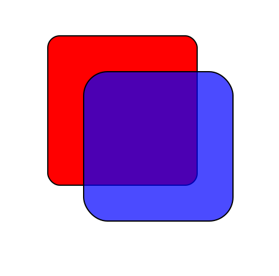

Title: Asset files
Date: 2019-02-27 13:41:17-08:00
Entry-ID: 910
UUID: 6d126189-7e41-5237-a673-0f12cdb48f39

Some tests for files bundled with an entry.

.....

[link to SVG](boxes.svg)
[link to SVG with spaces in filename](boxes with spaces in filename.svg)

[some source code](hello.cpp)

[link to entry should still go to entry](assets.md)

