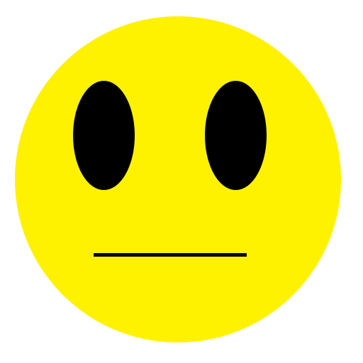

Title: Test of image renditions
Date: 2018-04-05 02:17:49-07:00
Entry-ID: 336
UUID: a28a68eb-c668-4fb8-9d3a-6cbcc3920772

Image rendition tests

.....

## External images

External image with width set


``

External image with height set


``

External image with width and height set, with different scaling modes:


```markdown

```

Image using static path


``


Force absolute URLs


``


## Local images


``


```markdown

```


``

} "test crop (left half of rawr.jpg, scaled down)")

```
} "test crop (left half of rawr.jpg, scaled down)")
```

,fullsize_crop=(95,69,435,315)} "different crops for thumbnail as fullsize")

```
,fullsize_crop=(95,69,435,315)} "different crops for thumbnail as fullsize")
```

Inline image with a gallery class:  should still be a block element

Inline image with no gallery class:  should be inline

Paragraph-level image set without a gallery class:


should still be in a paragraph

## Mixed-content gallery


```markdown

```

## PNG transparency

Base image:

 ``

converted to jpeg, no background:

 ``

converted to jpeg, black background:

 ``


converted to jpeg, red background using a tuple:

}) `})`

converted to jpeg, white background using hex code:

 ``


converted to jpeg, cyan background, multiple qualities on the spectrum:


```markdown

```

## Broken/parse failures


``


``


``


``


``
