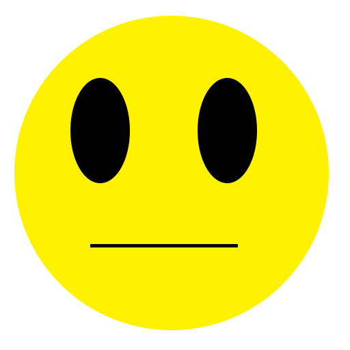

Title: Test of shaped images and image styles
Date: 2018-09-20 00:31:43-07:00
Entry-ID: 422
UUID: 6bd3fa69-efd9-5b96-b39f-e40958588481

Tests of shaped image floats

.....

Lorem ipsum dolor sit amet, consectetur adipiscing elit. Donec ornare nec elit sit amet suscipit. Aenean pellentesque ut dui at tincidunt. Sed placerat semper risus nec volutpat. Sed et feugiat ligula. Pellentesque habitant morbi tristique senectus et netus et malesuada fames ac turpis egestas. Pellentesque imperdiet gravida lectus id viverra. Pellentesque lacinia eros at imperdiet tempor. Duis at aliquet risus, id accumsan ex. Nulla ut magna ante. Vestibulum tellus turpis, consequat sed magna nec, bibendum congue mauris. Aenean dignissim quis neque ornare tempor.

Morbi elementum nunc vitae elit rhoncus, pellentesque egestas justo pulvinar. Donec pharetra leo sed neque fermentum tincidunt. Nulla facilisi. Nulla facilisi. Quisque vehicula mi sed dui commodo, nec bibendum augue aliquam. Praesent vitae dui eu libero hendrerit interdum at vitae neque. Aenean faucibus nunc porttitor, suscipit dui at, commodo mauris. Proin faucibus porttitor pulvinar. Vestibulum bibendum eu augue vitae ultricies. Sed maximus, leo ac viverra efficitur, orci neque venenatis enim, eu commodo massa elit in odio.

Etiam eu lacus ligula. Maecenas condimentum ligula ut mauris congue elementum id euismod lectus. Phasellus interdum eget enim et tincidunt. Phasellus finibus lectus nec nibh elementum, et fermentum ligula lobortis. Sed ultricies lacinia magna. Sed eu luctus leo, eget commodo enim. Duis ante turpis, commodo auctor viverra sit amet, mollis eget magna. Aenean lacinia nisl egestas, commodo mauris ac, blandit augue. Mauris non ultrices tellus, sed luctus nulla. Donec scelerisque, velit id porta commodo, erat lacus lacinia nisl, eget tincidunt nulla justo at libero. Praesent diam lectus, luctus a ultricies sit amet, sollicitudin eget arcu. Aliquam ligula urna, pellentesque vel porta vitae, pretium ac ipsum.

Aliquam a egestas nisi. Pellentesque fringilla sodales tortor, a aliquet nisi. Vivamus augue eros, mollis in rutrum id, sodales ac enim. Sed porttitor erat eget bibendum blandit. Maecenas pulvinar porttitor neque, viverra tempus massa porttitor id. Nulla viverra metus quis varius condimentum. Pellentesque fermentum non lectus et accumsan.

Sed rutrum lorem tristique augue dapibus, vel sodales sapien aliquam. Duis at molestie lacus, et dapibus est. Mauris varius, libero et feugiat posuere, metus ipsum tristique justo, vel vehicula eros diam rutrum lectus. Nunc laoreet, tellus mattis faucibus pellentesque, nisi risus interdum enim, ut ornare arcu neque sit amet tortor. Donec suscipit malesuada auctor. Duis sollicitudin laoreet ligula nec gravida. Morbi elementum libero nibh, eu consectetur risus ultrices nec. Nulla volutpat fermentum pellentesque. Praesent ullamcorper posuere ipsum, sit amet ornare odio consectetur vel. Nunc in orci at ex dignissim facilisis feugiat sagittis neque. Vestibulum pellentesque mauris aliquet pellentesque bibendum. Praesent eget venenatis enim. Suspendisse potenti.

